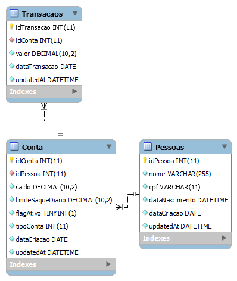
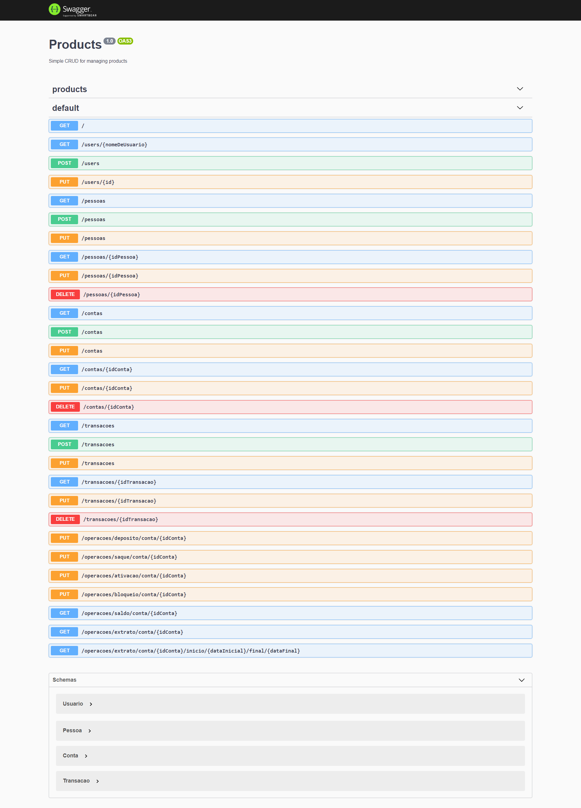

# API em Nestjs com Mysql | Docker

# <a name="indice"><a/> Índice
- [Requerimentos](#requerimentos)
- [Configuração](#configuracao)
- [Dependências](#dependencias)
- [Banco de Dados](#banco)
- [Execução da Aplicação](#execucao-app)
- [Banco de Dados](#banco)


[índice&#8613;](#indice)
### <a name="requerimentos"><a/>Requerimentos  

Requer [Node.js](https://nodejs.org/), [Typescript](https://www.typescriptlang.org/), [Nestjs](https://nestjs.com/), [Docker](https://www.docker.com/)

[índice&#8613;](#indice)
### <a name="configuracao"><a/> Configuração
Clone o projeto através desse repositório.
Edite as variáveis de ambiente no arquivo **.env** na raiz do projeto para configurar o acesso ao banco de dados.
Preencha os valores das variáveis de ambiente conforme exemplo abaixo.
##### Observação: Host no Windows
Se o sistema operacional for Windows mesmo configurando a variável ``` DATABASE_HOST ``` a maioria das vezes a mesma se mantém como localhost.

#### Variáveis de Ambiente
```sh
DATABASE_USER=root
DATABASE_HOST=localhost
MYSQL_DATABASE=nest
MYSQL_ROOT_PASSWORD=root
```
Feito isso o programa estará pronto para ser dockerizado.
Abra o projeto através de um terminal de comando e rode o seguinte comando:

```sh
docker-compose up -d
```
Com isso projeto será dockerizado e o mesmo montará o banco de dados necessário para a aplicação.
[índice&#8613;](#indice)

###  <a name="configuracao"><a/>Instalação de Dependêcias e run do sistema
Abra um terminal, na raiz do projeto, e instale as dependências. 
```sh
$ npm install
$ npm run start:dev
```
Com isso o programa estará pronto para ser usado através da url: ``` http://localhost:3000 ```
[índice&#8613;](#indice)

###  <a name="banco"><a/>Banco de Dados
Uma vez dockerizado e instalado as dependências o programa criará automaticamente todas as tabelas necessárias para o funcionamento do sistema.
### Modelo MRE do Banco de dados


###  <a name="execucao-app"><a/>Execução da Aplicação
---
##### Para ambiente Dev
Abra o terminal na raiz do projeto e execute:
```sh
$ npm run start:dev 
```

##### Para ambiente Prod
Em uma guia do terminal, na raiz do projeto, execute:
```sh
$ npm run start:prod 
```
----
 >O Nestjs, através do typescript, realizará a transpilação do código .ts em .js, e alocará no diretório dist na raiz do projeto. Esse é o diretório para publicação.
 ----
 >O Nestjs, está preparado para se trabalhar com o Sequelize ORM e ao rodar a aplicação toda a estrutura de tabelas será criada automaticamente para o banco de dados
 ----
 >No ambiente de DEV, o nestjs ficará assistindo os arquivos .ts, logo a cada alteração em um arquivo .ts, e automaticamente um novo arquivo .js será gerado ou atualizado.
 ----
 >No ambiente de PROD, o nestjs gerará uma única vez o diretório dist com a transpilação dos arquivos Typescript e acionará o node para levantar a aplicação apontando para o server na raiz do dist.
---
 [índice&#8613;](#indice)
 
 ###  <a name="testes-manuais"><a/>Testes Manuais
 ##### Insomnia
 Aqui eu usei o Insomnia para consumir a API da aplicação pode ser usar tambem o POSTMAN se preferir
 Tento o Insominia instaldo basta importar no Insomnia a collection ``` banking-nestjs.collection.json ``` que encontra-se dentro do diretório collections.
 Para isto ao abrir o programa ir em Import/Export e escolher a opção Import Data e abrir o arquivo especificado acima.

 >/collections/banking-nestjs.collection.json
 ---
 [índice&#8613;](#indice)
 ### <a name="rotas-app"><a/> Rotas da Aplicação
 ##### Host: localhost:5000
 
 [índice&#8613;](#indice)

 ##### Documentação das rotas via Swagger API em http://localhost:3000/docs 
 Aqui se encontra todas as rotas e as mesmas podem ser testadas via Insomnia/Postman
 Por favor, consultar a imagem abaixo.


 ---